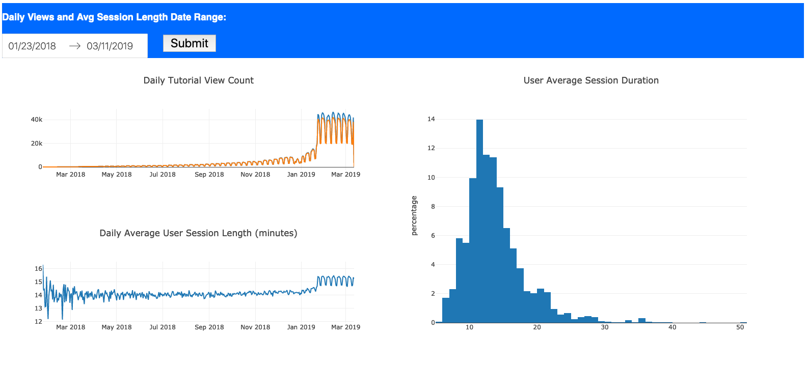
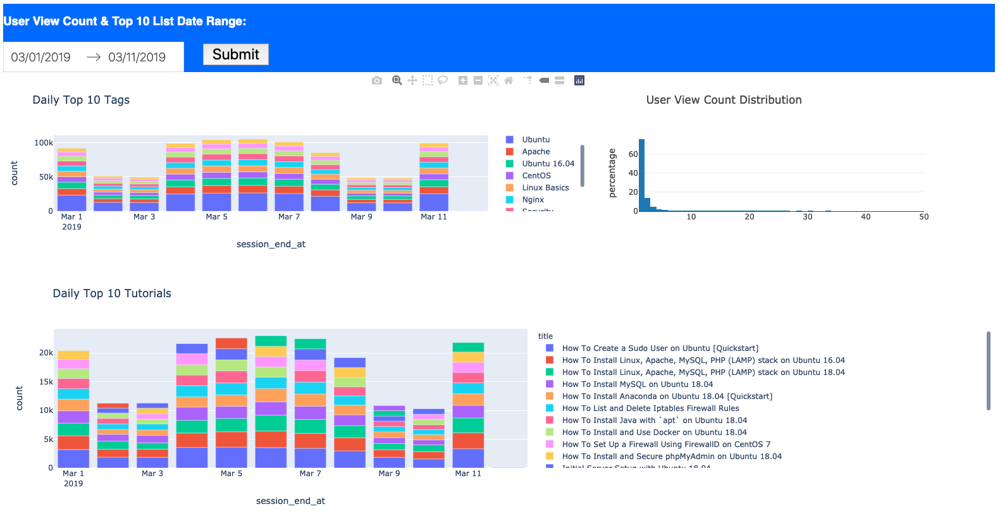

# Digital Ocean Data Engineer Assessment

This project is designed to be run on a local machine and will read the zip file from the provided digital ocean repo 
space into pandas for further aggregations and joins. The data is then fed into a dashboard app that can be viewed on 
http://127.0.0.1:8050/. A set of aggregated tables is saved locally to "./output"

csv's of output tables are available here:  
[User View Count](https://hireethanking.nyc3.digitaloceanspaces.com/digital_ocean/user_view_count_2019-03-01_2019-03-12.csv)  
[User Average Session](https://hireethanking.nyc3.digitaloceanspaces.com/digital_ocean/user_avg_session_2018-01-23_2019-03-12.csv)  
[Tutorial Daily Views](https://hireethanking.nyc3.digitaloceanspaces.com/digital_ocean/tutorial_daily_views_2018-01-23_2019-03-12.csv)  
[Daily Top Tags](https://hireethanking.nyc3.digitaloceanspaces.com/digital_ocean/daily_top_tags_2019-03-01_2019-03-12.csv)  
[Daily Top Tutorials](https://hireethanking.nyc3.digitaloceanspaces.com/digital_ocean/daily_top_tutorials_2019-03-01_2019-03-12.csv)  

## Running the script:
1. Clone the github repo
2. Install the packages listed in requirements.txt
3. Optionally, place a saved copy of the .zip file from the repo in the same directory as main.py to improve startup time
4. Run main.py, waiting for the flask app to load.
5. Open http://127.0.0.1:8050/

## Using the Dashboard
- The first section allows the user to select a date range for daily summary statistics and average user session length 
over the timespan.

- The second section runs top 10 stats and user view count on a smaller slice of data for detailed analysis.

